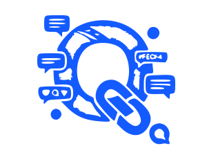

<br>
<p align="center">
  
</p>

<h1 align="center">QLink</h1>

<p align="center">
  A dynamic and interactive social community platform built with the Laravel framework.
</p>

<p align="center">
  <a href="#features">Features</a> •
  <a href="#-installation">Installation</a> •
  <a href="#-usage">Usage</a> •
  <a href="#-contributing">Contributing</a> •
  <a href="#-license">License</a>
</p>


**QLink** is a modern social networking and community platform designed to provide a seamless, interactive experience. It comes packed with essential features like user authentication, posts and comments, a follower system, direct messaging, real-time notifications, and content moderation tools.

## ✨ Features

  - **User Authentication & Authorization:** Secure registration, login, password reset, and email verification powered by Laravel Breeze.
  - **Posts & Comments:** Create rich posts, engage with comments, and foster community discussions.
  - **Follower System:** Follow and unfollow other users to build your network and personalize your content feed.
  - **Direct Messaging:** Real-time one-on-one conversations with message status indicators.
  - **Real-Time Notifications:** Instant alerts for new messages, comments, and follower actions using Laravel Echo and WebSockets.
  - **Content Moderation:** A system for users to report inappropriate content for administrative review.

## 🚀 Installation

### Prerequisites

  - PHP 8.1+
  - Composer
  - Node.js & npm
  - MySQL (or another compatible database)
  - Git

### Steps to Install

1.  **Clone the Repository**

    ```bash
    git clone https://github.com/Qaidsaher/QLink.git
    cd QLink
    ```

2.  **Install Dependencies**
    First, install PHP dependencies, then Node.js dependencies.

    ```bash
    composer install
    npm install
    ```

3.  **Set Up Your Environment**
    Copy the example environment file and generate your application key.

    ```bash
    cp .env.example .env
    php artisan key:generate
    ```

    Next, open the `.env` file and configure your database connection details (`DB_HOST`, `DB_PORT`, `DB_DATABASE`, `DB_USERNAME`, `DB_PASSWORD`).

4.  **Run Migrations & Compile Assets**
    Set up your database tables and compile your frontend assets.

    ```bash
    php artisan migrate
    npm run dev
    ```

5.  **Serve the Application**
    Start the local development server.

    ```bash
    php artisan serve
    ```

    Your QLink application is now running at **[http://localhost:8000](https://www.google.com/search?q=http://localhost:8000)**.

## 📂 Project Structure

Here is a simplified overview of the most relevant directories and files:

```
QLink/
├── app/
│   ├── Http/
│   ├── Models/
│   │   ├── User.php
│   │   ├── Post.php
│   │   └── Comment.php
│   └── ...
├── database/
│   └── migrations/
├── public/
│   └── images/
│       └── logo.svg
├── resources/
│   ├── css/
│   ├── js/
│   └── views/
├── routes/
│   └── web.php
├── .env
├── composer.json
└── package.json
```

## Usage

Once the application is running, you can:

  - **Register & Login:** Create an account or log in to access the platform.
  - **Create Posts:** Share your thoughts, images, and updates with the community.
  - **Engage:** Comment on posts and follow other users to see their content.
  - **Message Users:** Start private, real-time conversations with other members.
  - **Stay Updated:** Receive instant notifications for important interactions.

## Contributing

Contributions are what make the open-source community such an amazing place to learn, inspire, and create. Any contributions you make are **greatly appreciated**.

1.  Fork the Project
2.  Create your Feature Branch (`git checkout -b feature/AmazingFeature`)
3.  Commit your Changes (`git commit -m 'Add some AmazingFeature'`)
4.  Push to the Branch (`git push origin feature/AmazingFeature`)
5.  Open a Pull Request

Please see the `CONTRIBUTING.md` file for more detailed guidelines.

## 📜 License

This project is licensed under the MIT License. See the [LICENSE](LICENSE) file for details.

## Contact

saher qaid – [saherqaid2020@gmail.com](mailto:saherqaid2020@gmail.com)

Project Link: [https://github.com/Qaidsaher/QLink](https://www.google.com/search?q=https://github.com/%5BQaidsaher%5D/QLink)